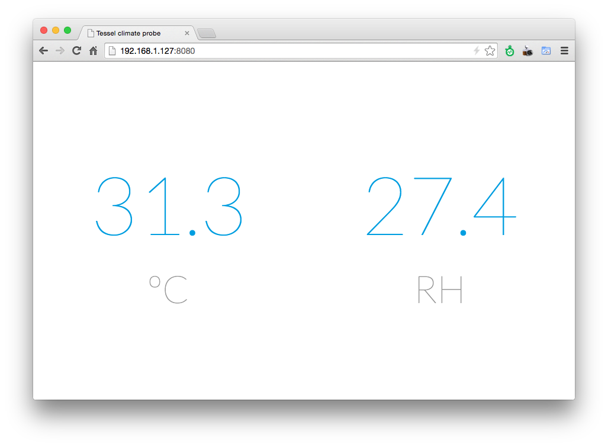

Tessel climate probe
====================

A simple package to use Tessel as a climate proble over WiFi.

  

## Requirements

A [Tessel](http://tessel.io) with [climate](https://tessel.io/modules#module-climate) module installed.

## What this package does

**NOTE**: This is just an experiment. 

Basically, I want Tessel to behave like a climate probe. So, this package does the following ops:

- It connects Tessel to the WiFi network specified in `wifi-conf.json`
- Once connected, it starts an HTTP web server on `{tessel-local-ip}:8080`
- If you navigate to `http://{tessel-local-ip}:8080`, you will see the UI above, updating every 5 seconds :)

## How to run

- Clone this repo
- `tessel run index.js` or if you want to push code into Tessel `tessel push index.js -l`

Note that Tessel WiFi module _isn't_ very reliable (at least right now). If you run into problems, you could try to:

- Erase Tessel WiFi settings with `tessel wifi -d`
- Erase Tessel filesystem by pressing **Config button**, then **Reset button** and then release and run `tessel erase`
- Re-push code with `tessel push index.js -l`
